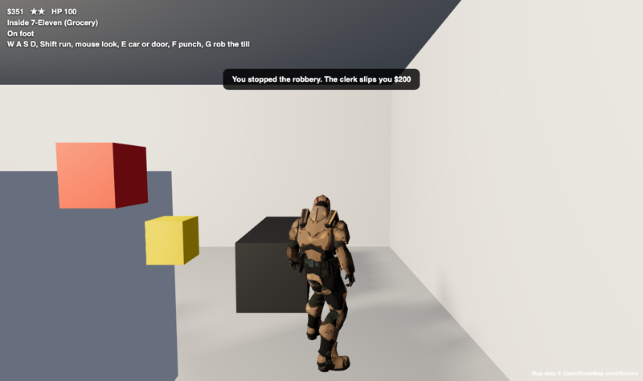

<h1 align="center">Rainjack</h1>

<b>A crime game set in the real Vancouver. Built in a day with Claude.</b>

<a href="https://rainjack.heyitsmejosh.com/play.html">Play now</a> · <a href="https://rainjack.heyitsmejosh.com/city.html">Real streets</a> · <a href="https://rainjack.heyitsmejosh.com/real.html">Real Vancouver (3D tiles)</a> · <a href="https://github.com/nulljosh/rainjack/releases/latest">Download apps</a>

| | | |
|---|---|---|
|  |  |  |
| Real downtown streets from OpenStreetMap | Walk into a real 7-Eleven and rob it | Kits Beach, with a real ocean |

Walk real downtown Vancouver, street by street. Rob a 7-Eleven on the corner where it actually is, outrun the cops across the Burrard Bridge, then switch to Alexandre in Victoria. It runs in any browser, phones included, and friends share one live city.

A crime game set in Vancouver and Victoria. It runs in any browser, phones included, and there's a native Mac app too.

You start downtown at Granville and Georgia. A short tutorial covers walking, shooting, stealing a car, driving to a beacon and switching characters. After that the missions start: car deliveries, taxi fares, and chases where you get three stars and then lose the cops. Punch someone and you get a star. Kill cops and you climb to five, with more cars coming for you and shooting back.

## Play
- Web: open `site/play.html` on a local server (`python3 -m http.server -d site`), or add it to your home screen on iOS or Android.
- Mac: `./build.sh && open "Rainjack.app"`

## How it fits together
Three versions of one game, sharing the same rules and the same map data.

1. **Main game** (`site/play.html`). A simplified Vancouver and Victoria with all the gameplay: story missions, cops and stars, three heroes, weapons, weather, saves. Runs on anything, phones included.
2. **Real Streets** (`site/city.html`). Real downtown built from OpenStreetMap by `tools/osm.py`, the approach from the fable51-worlds repo: real buildings, street names, walk-in shops, traffic, cops and online play. Gameplay from the main game moves here over time.
3. **Unreal** (`unreal/`, `UNREAL.md`). The high-end version. Google's photorealistic 3D tiles, streamed through Cesium, give the real city its look, and Claude builds it through Unreal's MCP. `unreal/setup_vancouver.py` drops the city in.

The Real Vancouver beta (`site/real.html`) is the same Google tiles in a browser, a preview of what Unreal will show.

Apps for iOS, Mac, Windows, Linux and Android (`apps/`) are thin shells around the live web game, so every platform gets every update at once. The online world is one Cloudflare Durable Object in `worker.js`.

## Controls
W A S D move, Shift run, Space jump, mouse look (click to lock), click or Enter to attack, F punch, Q fists or pistol, E get in or out of a car, Tab to cycle Joshua, Ben and Alexandre, Esc pause, F full screen. On phones: a stick on the left, drag to look, and buttons on the right.

## What's in it
Fists that land: people fight back or run, and they fall over when they go down. A Real Vancouver beta (`site/real.html`) streams the actual city from Google's photorealistic 3D tiles through Cesium.

## Real streets, online
`site/city.html` is downtown Vancouver built from OpenStreetMap by `tools/osm.py`: 3,359 buildings at real heights, 8,378 named streets with signs, traffic lights and streetlights, and 2,609 real places you can walk into, each with an interior that fits (rob the till at 7-Eleven, or stop the robbery). One Cloudflare Durable Object (`worker.js`) is the shared world: everyone on the page sees everyone else live.

## A living city
Each neighbourhood has its own people and its own lines: the Downtown Eastside, Gastown, the West End and Coal Harbour, Yaletown, Kitsilano and Victoria. Strangers walk up to bump you, chat, or pick a fight. Traffic keeps to the right lane. You hear cars go by, birds, gulls, and rain, and the rain comes and goes.

## Credits
People: Microsoft Rocketbox avatars and animations, MIT (converted with Blender, tools on request). Hero body from Mixamo.
Car model: Ferrari 458 Italia by vicent091036, CC-BY 4.0. Character: Soldier from the three.js examples (Mixamo). Both load from the three.js repo on jsDelivr.

## Three heroes
Joshua runs Gastown in a yellow rain jacket. He earns 50% more per mission and the cops lose interest in him twice as fast. Ben hangs out in Kitsilano. He's the fastest runner, jumps highest, and drops people in two punches. Alexandre works downtown Victoria. He aims steadier, drives faster, and takes less damage.

## Weather and story
The weather is live. The game asks Open-Meteo about downtown Vancouver every ten minutes, so if it's raining there, it's raining in the game. Five story missions come first, then side jobs forever. Your game saves itself.

## Platforms
Web, plus apps for iOS and Mac (`apps/apple`), Windows and Linux (`apps/desktop`), and Android (`apps/android`). Tagging a release builds all of them in CI.

## Inside the game
Nine real landmarks: Canada Place, Harbour Centre, the Gastown steam clock, the Art Gallery, BC Place, Rogers Arena, Science World, Granville Island and the BC Legislature. English Bay and Kits beaches, Stanley Park, the Lions Gate, Burrard and Granville bridges. Traffic, people walking down the sidewalks, five star heat that cools once the cops lose sight of you, health, WASTED and BUSTED, XP and levels, and ten achievements saved in your browser.

## How it stacks up
Graded honestly against the real thing.

| Game | Grade | What we have | Biggest gaps |
|---|---|---|---|
| GTA 1/2 | A- | Steal, drive, stars, missions, a real city, phones | Nothing big. It's past this. |
| GTA 3 | C | Third person, fists and a pistol, five star heat, cops that shoot back, missions, rain, day and night, neighbourhoods | Story and cutscenes, voice acting, radio, more weapons, car damage and explosions, a map a lot bigger than downtown, interiors, saving |
| GTA 4 | D | Street life, people who react, a real city in the beta | Physics and ragdolls, animated people instead of posed ones, driving that feels heavy, a dense city with real buildings in the main game, phone and friends |
| GTA 5 | F | Two heroes you swap between | Three full characters with stories, heists, huge map with countryside and water, planes, online, skills |
| GTA 6 (previews) | F | Photoreal streets only in the Real Vancouver beta | Crowds of hundreds, photoreal everything, full physics, a whole state to explore |

The quickest wins toward GTA 3: radio stations, car damage and explosions, a second and third weapon, a save, and a story mission chain. Toward GTA 4 and up: move the game onto the real city (the beta) and then onto Unreal.

## The GTA 4+ path
Two resources make that possible, and neither is set up yet:
- **Google Maps Platform Photorealistic 3D Tiles**, streamed through Cesium, gives the real Vancouver: every building, street and tree. It needs a Google Maps API key with billing turned on.
- **Unreal MCP in Unreal Editor** (UE 5.8) lets Claude drive the editor directly. Cesium for Unreal loads those tiles, and Unreal brings physics, lighting and animation.

That's a separate project. Unreal needs a large download and disk space, and Epic has to be signed into by hand.

## QA
`GS_QA=1 ./rainjack` plays the Mac game with no window and checks 23 things. The web build has a 31-check headless suite (`node tests/web.mjs`) covering the menu, saves, combat, explosions, neighbourhoods, corrupt saves, blocked storage, offline mode and phones. CI runs the Mac checks on every push.

See roadmap.md for what's next.

## License
MIT. See LICENSE. Privacy: PRIVACY.md (also at rainjack.heyitsmejosh.com/privacy.html). Third-party models keep their own licenses, listed under Credits.
