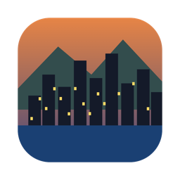
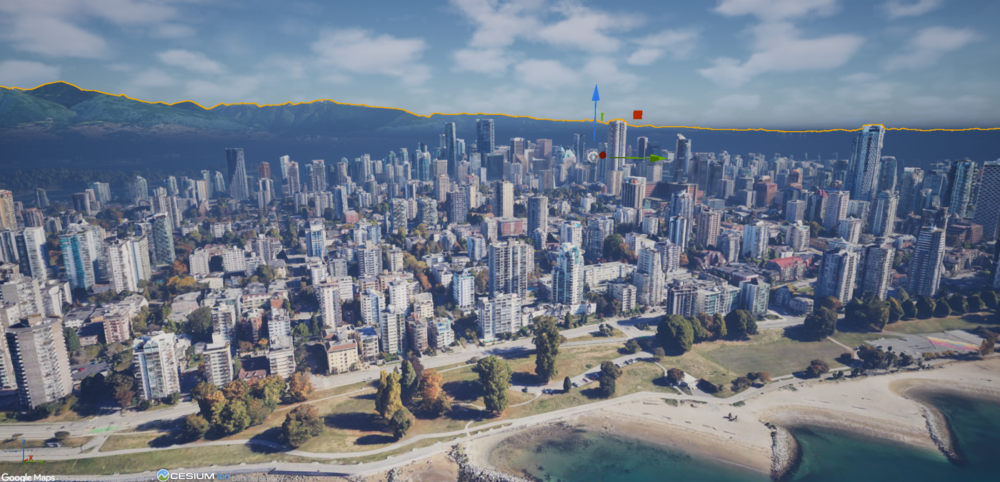
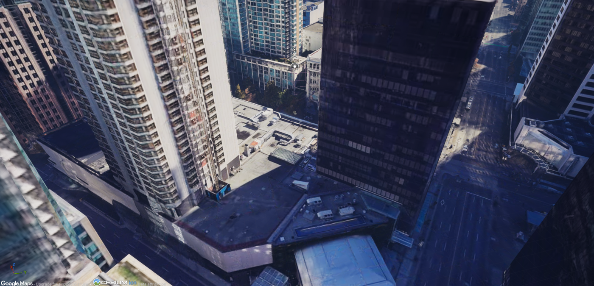
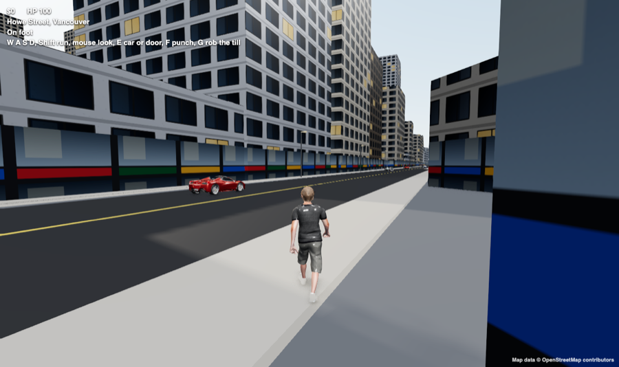
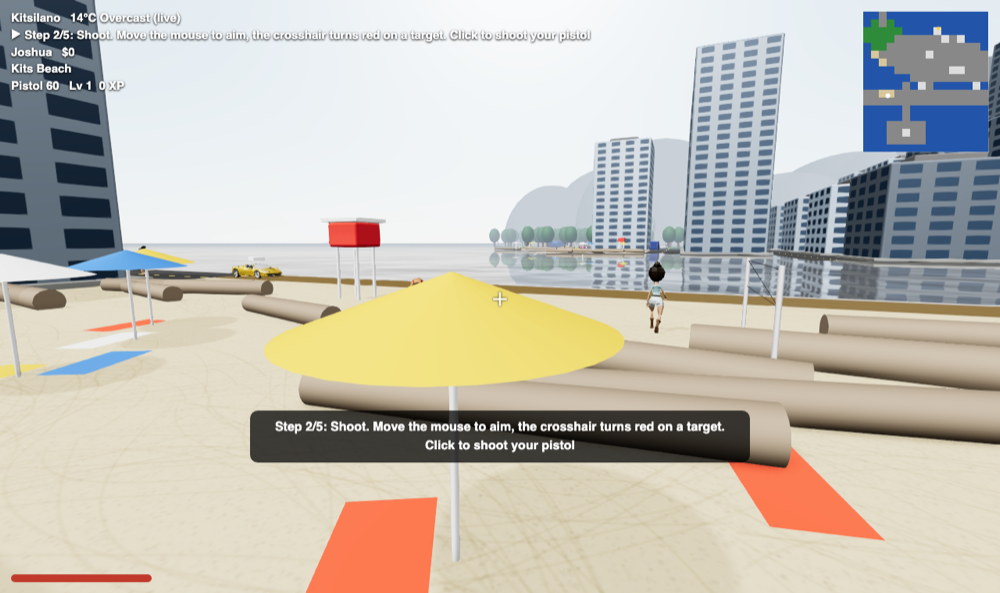

<h1 align="center">Vancouver Vice</h1>

<b>Welcome to Vancouver. Don't get caught.</b>

It rains nine months a year. Rent is four grand. Everybody's got a hustle.

Joshua runs downtown. Ben chills and cruises around Kits. Alexandre does deliveries and works an office job across the water in Victoria. Switch between them any time.

Steal a car on Granville. Rob the 7-Eleven. Lose the cops on the Burrard Bridge, or don't. The more trouble you cause, the more stars you get.

This is the real city. The Unreal build streams Google's 3D scan of Vancouver, so you start outside the actual Apple Store on Georgia and walk to the actual Art Gallery.

| | | |
|---|---|---|
|  |  |  |

## Play
**[Play in your browser](https://vancouvervice.heyitsmejosh.com)**, on your phone or your computer. Or grab the app for Mac, Windows, Linux, iPhone or Android from [releases](https://github.com/nulljosh/vancouvervice/releases/latest).

## Controls
W A S D to move, Shift to run, Space to jump. Mouse to look, click to shoot, F to punch. E to jack a car, R for the radio. Tab to switch characters. Esc for the menu.

On a phone: stick on the left, drag to look, buttons on the right.

## Two builds
The browser build plays anywhere today. The Unreal build is the real-looking one, running on a Mac for now: real Vancouver, a third-person hero and missions at real places. Next up: scan your face with your iPhone and play as yourself.

---
Apache 2.0 license. Map data © OpenStreetMap contributors. People by Microsoft Rocketbox (MIT). Car model by vicent091036 (CC-BY 4.0). Privacy: [vancouvervice.heyitsmejosh.com/privacy.html](https://vancouvervice.heyitsmejosh.com/privacy.html).

[Changelog](CHANGELOG.md) · [Roadmap](roadmap.md) · [How it works](docs/ARCHITECTURE.md) · [Contributing](CONTRIBUTING.md) · [Security](SECURITY.md)
